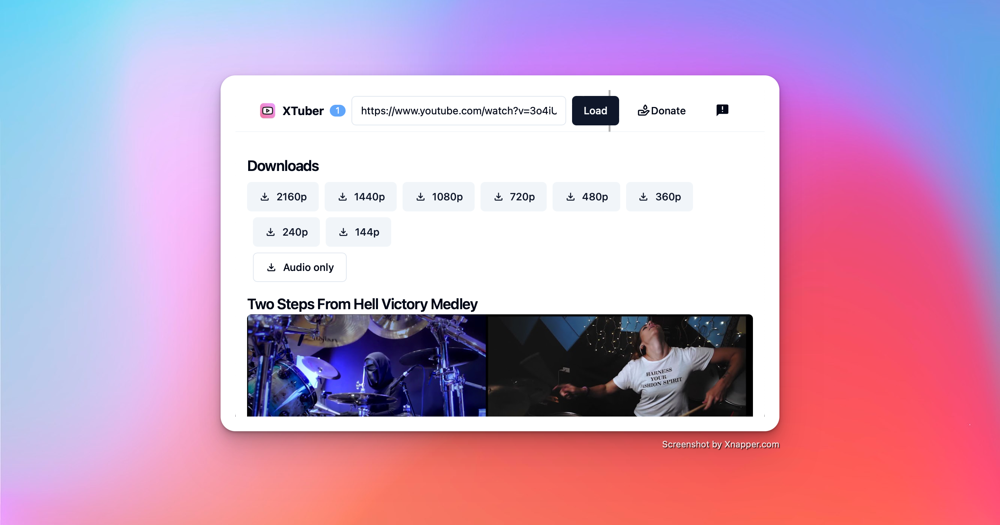

# XTuber - Simple YouTube Downloader

[Releases](https://github.com/chientrm/xtuber/releases)

## Development

- Install [Tauri](https://tauri.app/v1/guides/getting-started/prerequisites)
- Download yt-dlp and ffmpeg using script:

  - For MacOS: `install-macos.sh`
  - For Linux: `install-linux.sh`
  - For Windows: `install-windows.bat`
